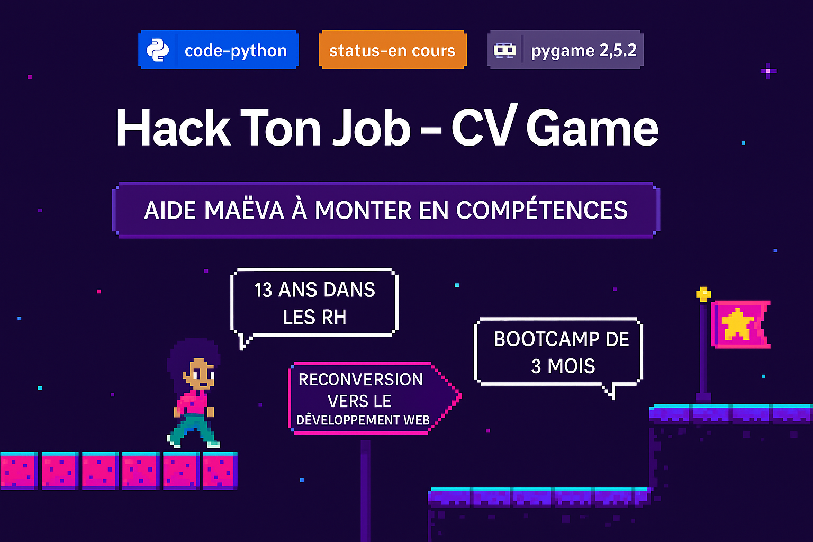

"""## 🎮 Hack Ton Job - CV Game

.

Un mini jeu développé en Python avec Pygame, qui transforme mon **parcours professionnel** en une **expérience ludique et interactive**.

👩‍💻 Le joueur incarne **Maëva** (*moi-même*), développeuse en reconversion, et traverse différentes étapes de son parcours (RH, reconversion, formation, projets, etc.) tout en découvrant mes compétences, mes projets et mes objectifs de carrière.  
Une manière originale de **me présenter aux recruteurs** et **de démontrer mes compétences Python** dans un projet complet.

---

## 🎯 Objectifs du projet

- ✅ Valoriser mon parcours pro de façon créative  
- ✅ Montrer ma capacité à structurer un projet Python avec Pygame  
- ✅ Renforcer mes compétences en développement 2D, architecture logicielle et POO  
- ✅ Proposer un portfolio **original, immersif et mémorable**

---

## 🧠 Stack technique

- **Python 3**
- **Pygame**
- **Figma** (pour les maquettes)
- **Pixel Art** (sprites personnalisés)
- Architecture MVC simple (séparation `main.py`, classes, assets)

---

## 🗂️ Structure du projet

cvgame_python/  
├── assets/                  # Sprites, backgrounds, sons  
├── classes/                 # Classes du jeu (joueur, bulles, zones…)  
├── venv/                    # Environnement virtuel Python  
├── main.py                  # Point d'entrée du jeu  
├── settings.py              # Paramètres globaux  
├── requirements.txt         # Dépendances  
└── README.md                # Ce fichier

---

## ▶️ Lancer le jeu

**1. Créer un environnement virtuel**  
`python -m venv venv`

**2. Activer le venv (Windows)**  
`.\venv\Scripts\activate`

**3. Installer les dépendances**  
`pip install -r requirements.txt`

**4. Lancer le jeu**  
`python main.py`

---

## 🧩 Ce que le jeu contient

- Déplacement gauche/droite du joueur  
- Plateformes en pixel art  
- Bulles de texte automatiques (zones de narration)  
- Histoire de ma reconversion  
- Objectifs professionnels mis en scène  
- Drapeau de fin : **Objectif Alternance Python/Devops 💼**

---

## 🔥 Ce projet me permet de…

- Me démarquer auprès des recruteurs 👀  
- Montrer que je suis capable de **structurer un projet from scratch**  
- M’amuser tout en montant en compétences sur Python / Pygame  
- Valoriser mes expériences avec une vraie touche personnelle

---

## 🧠 À propos

Je m'appelle **Maëva Rodrigues**, développeuse en reconversion, passionnée par la tech et l'apprentissage.  
Ce projet s’inscrit dans mon objectif de trouver une **alternance en développement Python/Devops** dès **janvier 2026**.

📬 Tu veux échanger avec moi ?  
➡️ [LinkedIn](https://www.linkedin.com/in/maeva-rodrigues-dev/)  
